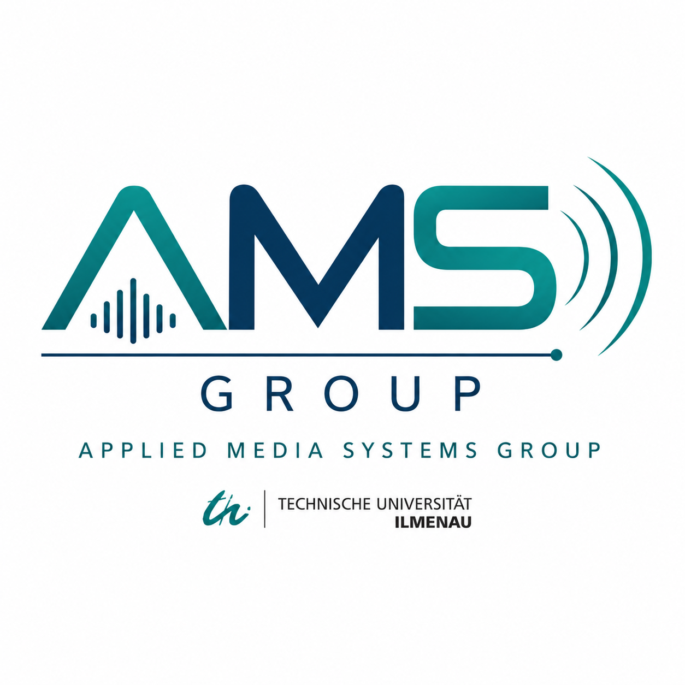

# 🎓 Applied Media Systems — Onboarding

<p align="center">
  
</p>

<p align="center">
  <strong>Onboarding resources for new teaching and research staff in the Applied Media Systems group at TU Ilmenau</strong>
</p>

<p align="center">
  <a href="https://www.tu-ilmenau.de/mt-ams">🌐 AMS Website</a> •
  <a href="https://github.com/TUIlmenauAMS">💻 GitHub Organization</a> •
  <a href="Applied%20Media%20Systems%20Group%20%E2%80%93%20Onboarding%20Guide%20for%20New%20Teaching%20and%20Research%20Assistants.md">📘 Full Onboarding Guide</a> •
  <a href="https://chat-ai.academiccloud.de/chat?settings=eyJzeXN0ZW1fcHJvbXB0IjoiWW91IGFyZSB0aGUgb25ib2FyZGluZyBhc3Npc3RhbnQgZm9yIG5ldyB0ZWFjaGluZyBhbmQgcmVzZWFyY2ggc3RhZmYgaW4gdGhlIEFwcGxpZWQgTWVkaWEgU3lzdGVtcyBncm91cCBhdCBUVSBJbG1lbmF1LlxuXG5IZWxwIG5ldyBncm91cCBtZW1iZXJzIGxlYXJuIHRoZSBncm91cCdzIHJlc2VhcmNoIHRvcGljcywgdGVhY2hpbmcgcmVzcG9uc2liaWxpdGllcywgc29mdHdhcmUgaW5mcmFzdHJ1Y3R1cmUsIE1vb2RsZSBjb3Vyc2VzLCBHaXRIdWIgcmVwb3NpdG9yaWVzLCBKdXB5dGVyIG5vdGVib29rcywgYm9va3MsIGFuZCBwdWJsaWNhdGlvbnMuXG5cbldoZW4gYXNrZWQgYWJvdXQgYSBjb3Vyc2UsIGZpcnN0IHByb3ZpZGUgYSBzdHJ1Y3R1cmVkIG92ZXJ2aWV3IGFuZCBwb2ludCB0byB0aGUgcmVsZXZhbnQgbGVjdHVyZSBtYXRlcmlhbCwgYm9va3MsIHBhcGVycywgbm90ZWJvb2tzLCBhbmQgTW9vZGxlIHJlc291cmNlcy5cblxuRW5jb3VyYWdlIGFjdGl2ZSBsZWFybmluZy4gT2ZmZXIgdG8gdGVzdCB0aGUgdXNlciBieSBhc2tpbmcgb25lIHF1ZXN0aW9uIGF0IGEgdGltZSwgd2FpdGluZyBmb3IgdGhlIGFuc3dlciwgZXZhbHVhdGluZyBpdCwgYW5kIGFkYXB0aW5nIHN1YnNlcXVlbnQgcXVlc3Rpb25zIHRvIHRoZSB1c2VyJ3MgbGV2ZWwuXG5cbkZvciB0ZWFjaGluZyBwcmVwYXJhdGlvbiwgaGVscCBpbnN0cnVjdG9ycyBjcmVhdGUgc2VtaW5hciBxdWVzdGlvbnMsIHByb2dyYW1taW5nIGV4ZXJjaXNlcywgTW9vZGxlIHF1aXp6ZXMsIGFuZCBwcm9qZWN0IGNoYWxsZW5nZXMgd2l0aCBvYmplY3RpdmUgYW5kIHF1YW50aWZpYWJsZSBncmFkaW5nIGNyaXRlcmlhLlxuXG5DbGVhcmx5IGRpc3Rpbmd1aXNoIGJldHdlZW4gaW5mb3JtYXRpb24gY29udGFpbmVkIGluIHRoZSBwcm92aWRlZCBncm91cCBtYXRlcmlhbCBhbmQgZ2VuZXJhbCBrbm93bGVkZ2UuIElmIGdyb3VwLXNwZWNpZmljIGluZm9ybWF0aW9uIGlzIHVuYXZhaWxhYmxlLCBzYXkgc28gcmF0aGVyIHRoYW4gaW52ZW50aW5nIGl0LiIsIm1vZGVsIjp7ImlkIjoicXdlbjMtMzBiLWEzYi1pbnN0cnVjdC0yNTA3In0sInRlbXBlcmF0dXJlIjowLjUsInRvcF9wIjowLjUsImVuYWJsZV90b29scyI6dHJ1ZSwidG9vbHMiOnsid2ViX3NlYXJjaCI6ZmFsc2UsImltYWdlX2dlbmVyYXRpb24iOnRydWUsImltYWdlX21vZGlmaWNhdGlvbiI6dHJ1ZSwiYXVkaW9fZ2VuZXJhdGlvbiI6dHJ1ZSwidmlkZW9fZ2VuZXJhdGlvbiI6ZmFsc2UsImFyY2FuYSI6dHJ1ZSwibWNwIjpmYWxzZX0sImFyY2FuYSI6eyJpZCI6ImdlcmFsZC5zY2h1bGxlci9PbmJvYXJkaW5nIn19">💻 Onboarding Chatbot with 'Academic Cloud'</a> 
</p>

---

## 👋 Welcome!

Welcome to the **Applied Media Systems (AMS)** group at the
**Institute for Media Technology, Technische Universität Ilmenau**.

This repository is intended as a practical starting point for new **teaching and research assistants** joining the group.

The goal is not simply to read documentation. During onboarding you should actively explore our

* 🎓 courses and Moodle environments,
* 💻 GitHub repositories,
* 📓 Jupyter notebooks and Google Colab examples,
* 🤖 lecture and research chatbots,
* 📚 books and publications,
* 🔬 research projects,
* 🧪 Moodle quizzes and Virtual Programming Lab exercises.

The guiding idea is:

> **Learn the group by using its tools, teaching material, software, and research.**

---

# 🚀 Start Here

The main onboarding document is:

### 👉 [Applied Media Systems Group — Onboarding Guide for New Teaching and Research Assistants](Applied%20Media%20Systems%20Group%20%E2%80%93%20Onboarding%20Guide%20for%20New%20Teaching%20and%20Research%20Assistants.md)

It contains the complete onboarding workflow, including:

1. TU Ilmenau IT infrastructure
2. Nextcloud and Moodle
3. Moodle Virtual Programming Lab
4. GitHub, Jupyter and Colab
5. Introduction to AMS research
6. Lecture chatbots
7. Chatbot-assisted seminars
8. Moodle quizzes and programming projects
9. Objective and quantifiable grading
10. Course-specific teaching preparation
11. A suggested four-week onboarding plan
12. An onboarding completion checklist

---

# 🗺️ Onboarding at a Glance

| Week  | Focus                           | Main Activities                                          |
| ----- | ------------------------------- | -------------------------------------------------------- |
| **1** | 🧭 Infrastructure & orientation | TU account, Moodle, Nextcloud, GitHub, Jupyter, chatbots |
| **2** | 🎓 Teaching preparation         | Courses, books, exercises, notebooks, Moodle quizzes     |
| **3** | 🔬 Research orientation         | Key papers, research repositories, software experiments  |
| **4** | 👨‍🏫 Teaching rehearsal        | Prepare and conduct a mock seminar                       |

A more detailed version of this plan can be found in the [full onboarding guide](Applied%20Media%20Systems%20Group%20%E2%80%93%20Onboarding%20Guide%20for%20New%20Teaching%20and%20Research%20Assistants.md).

---

# 🎓 Teaching Resources

Many AMS courses combine

**Lecture → Book → Python/Jupyter → Chatbot → Moodle → Seminar → Project**

to provide an interactive learning workflow.

Our course-specific GitHub repositories and AI tutors are collected here:

### 👉 [Lecture GitHub Repositories & Chatbots](lecture_github_and_chatbots.md)

Courses currently covered include:

* Digital Signal Processing for Media Technology / GVT (DSM)
* Computer Animation
* Advanced Digital Signal Processing (ADSP)
* Audio Coding
* Multirate Signal Processing (MRSP)
* Multimedia Programming
* Video Coding
* Machine Learning for Audio Signals

The lecture chatbots can be particularly useful during onboarding. For example:

> *I am a new seminar instructor for this course. Give me an overview of the course, its learning objectives, the most important concepts, recommended reading, and the exercises I should be able to solve.*

They can also act as interactive tutors:

> *Ask me a question about this lecture. Wait for my answer, evaluate it, explain what I missed, and adapt the next question to my level.*

---

# 🔬 Research Orientation

New group members should also become familiar with the main AMS research directions.

These include, among others:

* 🎵 audio coding and perceptual audio processing
* 🔀 filter banks and multirate signal processing
* 🎤 source separation
* 🧠 deep learning for audio
* 🎹 singing-voice and music processing
* ⚡ low-delay signal processing
* 📈 black-box and zeroth-order optimization
* 🤖 machine learning and neural signal processing

A curated starting point is available here:

### 👉 [Key AMS Publications](key_publications.md)

The list contains selected books, papers, software repositories and background material intended specifically for onboarding rather than as a complete bibliography.

---

# 🤖 Research Chatbots & Software

Some AMS research areas have dedicated AI assistants and accompanying GitHub repositories.

### 👉 [Research Projects — GitHub Repositories & Chatbots](research_projects_github_chatbots.md)

These currently include topics such as:

* Random Directions and black-box optimization
* low-delay source separation
* instrumental timbre transfer
* disentangled representations of timbre and pitch
* climate, energy and technology

Use the chatbots as **interactive entry points**, but verify important technical statements against the corresponding publications, source code and experimental results.

---

# 💻 GitHub & Jupyter

A central part of the onboarding is learning by running our software.

A good workflow for a new repository or notebook is:

```text
Open → Run → Understand → Modify → Predict → Test → Explain
```

For a Jupyter notebook:

1. Run all cells.
2. Make sure you understand the input and output.
3. Change one parameter.
4. Predict the effect before running the code.
5. Run the modified version.
6. Explain the result.

Depending on the project, examples may be run using:

* Jupyter Notebook
* JupyterLab
* Google Colab
* GitHub Codespaces
* a local Python environment

Explore the complete AMS GitHub organization:

### 👉 https://github.com/TUIlmenauAMS

---

# 🧪 Moodle & Virtual Programming Lab

Teaching assistants should become comfortable with Moodle from both the **student** and **instructor** perspectives.

Important features include:

* course material
* assignments
* quizzes
* grading
* student groups
* seminar organization
* Virtual Programming Lab (VPL)

As an onboarding exercise, try creating a small automatically tested programming task, for example:

* downsampling / upsampling
* FFT computation
* digital filtering
* convolution
* audio normalization
* simple neural-network inference

The aim is to make exercises **reproducible, testable and objectively gradable**.

---

# 📚 Recommended Reading

Two useful broad introductions to the group's signal-processing work are:

### Multirate Signal Processing

**Gerald Schuller**
*Multirate Signal Processing with Examples in Python*
Springer, 2026

➡️ [MRSP Tutorials & Notebooks](https://github.com/TUIlmenauAMS/MRSP_Tutorials)

### Filter Banks and Audio Coding

**Gerald Schuller**
*Filter Banks and Audio Coding: Compressing Audio Signals Using Python*
Springer, 2020

➡️ [Audio Coding Tutorials & Notebooks](https://github.com/TUIlmenauAMS/AudioCoding_Tutorials)
➡️ [Python Audio Coder](https://github.com/TUIlmenauAMS/Python-Audio-Coder)

For a curated selection of research papers, see the
👉 [AMS Key Publications](key_publications.md).

---

# ✅ When Is Onboarding Complete?

By the end of onboarding, you should be able to:

* [ ] access the relevant TU Ilmenau systems
* [ ] navigate the Moodle courses you will teach
* [ ] find teaching material in Nextcloud
* [ ] find and clone relevant AMS GitHub repositories
* [ ] run and modify Jupyter/Colab examples
* [ ] use the lecture chatbots effectively
* [ ] explain the structure of your assigned courses
* [ ] solve representative course exercises
* [ ] create and inspect Moodle quizzes
* [ ] create a small VPL programming exercise
* [ ] identify the main AMS research areas
* [ ] read and explain selected AMS publications
* [ ] prepare a seminar exercise
* [ ] define objective grading criteria for a project
* [ ] conduct a short mock seminar

The complete checklist is available in the [full onboarding guide](Applied%20Media%20Systems%20Group%20%E2%80%93%20Onboarding%20Guide%20for%20New%20Teaching%20and%20Research%20Assistants.md).

---

# 🌱 The Main Principle

You do **not** need to memorize everything in the first weeks.

A successful onboarding means knowing:

> **where to find information, how to use the group's tools, and how to independently prepare for teaching and research.**

The workflow

**Course material → Books & Papers → Jupyter → Chatbot → Moodle → Seminar → Research**

is intended to make that process practical and reproducible.

---

<p align="center">
  <strong>Applied Media Systems · TU Ilmenau</strong><br>
  <a href="https://www.tu-ilmenau.de/mt-ams">www.tu-ilmenau.de/mt-ams</a>
</p>

